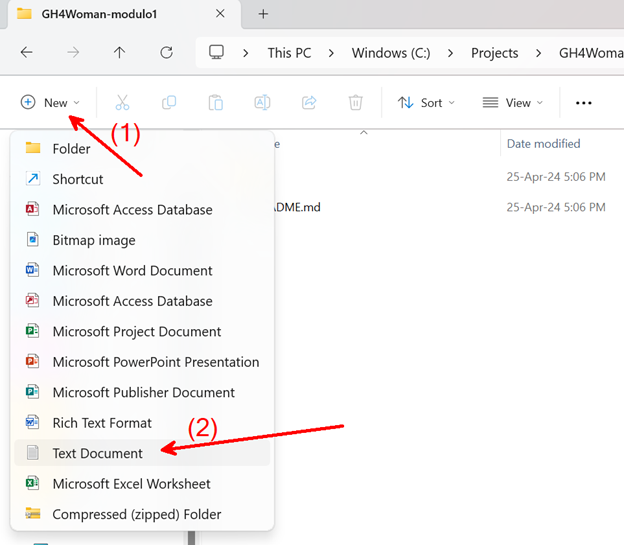

**Alteração no Laboratório:**
Devido ao limite diário de adição de colaboradores aos repositórios GitHub, realizamos uma pequena alteração no laboratório para que todas possam realizar a atividade mesmo sem a permissão de colaborador, onde ao invés de clonar diretamente foi adicionado o passo de fork do repositório, onde o clone agora passa a ser do repositório criado pelo fork.
Quem tem a permissão de colaborador e já finalizou a atividade utilizando o clone diretamente não é necessário realizar a atividade novamente!

# Laboratório – Módulo 1: Introdução ao Git e GitHub

Neste laboratório, vamos realizar algumas funções básicas do Git e GitHub. Ao concluir, você terá realizado operações de criação de arquivos e registro de mudanças, assim como submissão e disponibilização deste arquivo dentro de um repositório no GitHub e tudo isso em sua própria Branch. Vamos embarcar!

1. Navegue até o repositório GitHub através deste [link](https://github.com/wesleygomes022/GH4Woman-modulo1)
2. Faça o Fork do repositório 
    1. Clique em Fork do lado direito 
       (Imagem 1 passo 2 - Print do repositório com seta apontando para o botão fork ao lado direito da tela)
    2. Garanta que em Owner esteja seu usuário selecionado, mantenha as outras opções por padrão e clique em create fork. 
        (Imagem 2 passo 2 - Tela de criação do Fork) 

3. Clone o Repositório
    1. Vá em Code (ao lado direito da tela) e copie o link HTTPS do repositório criado pelo fork 
    (Imagem 1  passo 3 - Imagem do repositório com setas apontando para o botão Code e então para o link HTTPS) 

    2. Em seguida, abra um terminal powershell e com o git já instalado em sua máquina e rode o comando `git clone <link copiado>` 
(lmagem 1 passo 3: Print do terminal com a execução do comando git clone)
    
4. Abra o repositório no MS Explorer e crie um arquivo de texto com a inicial do seu nome e seu sobrenome escrito. Ex: se seu nome for **Geovana Souza**, seu arquivo deve se chamar **gsouza.txt**. 

   (lmagem 1 passo 4: Pasta do repositório clonado apontando para o botão New e então Text Document)
   

    (Imagem 2 passo 4: arquivo gsouza selecionado na pasta criada)

5. Abra o arquivo *.txt* com seu nome e escreva seu nome completo dentro dele. Após isto, salve (Ctrl + S) e feche o arquivo. 
(imagem passo 5: Arquivo de texto criado aberto com o nome "Geovana Souza" escrito dentro dele).

6. Volte ao Powershell. Vá ao diretório do repositório clonado executando cd GH4Woman-modulo1 e então crie uma Branch com o mesmo nome de seu arquivo *.txt* (sua inicial + sobrenome). Faça isto através do comando `git checkout -b <nome-branch>` 
(imagem passo 6: print de do terminal da execução do comando de exemplo: git checkout -b gesouza).

7. Execute o comando `git status`: retorna o status de todos os comandos no **working directory** e **staging area**.
    
(imagem passo 7: print de do terminal da execução do comando git status. Comando retornou: On branch gesouza. Untracked files: gsouza.txt)

    > Observe que ele nos retorna que o arquivo foi adicionado ao working directory.

8. Execute o comando `git add <nome-arquivo>`: adiciona o arquivo à staging area. 
(imagem passo 8: print do terminal da execução do comando de exemplo: git add gsouza.txt. Comando retorna "Changes to be committed: new file: gesouza.txt)

    > Veja que o mesmo arquivo agora aparece na cor verde e já na staging area.

9. Execute o comando `git commit -m “adicionado arquivo com o meu nome”`: este comando registra as alterações e gera um novo commit como parte do histórico do repositório. 
(imagem passo 9: print do terminal da execução do comando de exemplo: git commit -m "adicionado arquivo com o meu nome". Comando retorna: [gesouza dc7f6cf] adicionado arquivo com o meu nome).

10. Execute o comando `git push -u origin <nome-branch>`: este comando irá criar sua Branch remota (no repositório do GitHub) e fará o carregamento deste commit para lá. 
(imagem passo 10: print do terminal da execução do comando de exemplo: git push -u origin gesouza. O print enfatiza o retorno: To https://github.com/geovanams/GH4Women-modulo1.git. New branch gesouza -> gesouza. branch 'gesouza' set up to track 'origin/gesouza').

11. Navegue até o repositório no GitHub (https://github.com/seuUsername/GH4Woman-modulo1), clique no ícone da *main branch* e selecione sua própria branch. 
(imagem 1 passo 11: Tela do Repositório no Github com seta apontando para o botão main e então seta apontando para o nome da branch gesouza)

    Após isto, você poderá visualizar seu arquivo criado. 

Não é necessário fazer o pull request, pois vamos aprender nas próximas aulas. 🙂

### Parabéns! Você concluiu o laboratório com sucesso! 🎉
