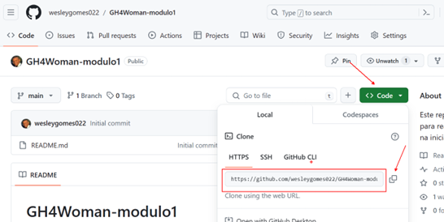
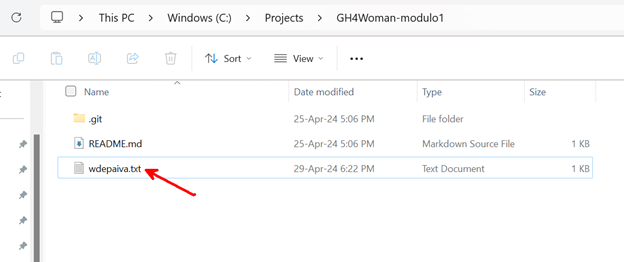
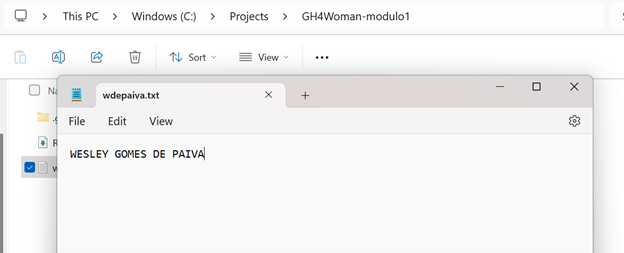
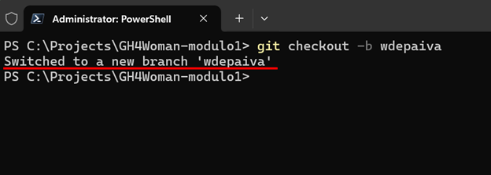
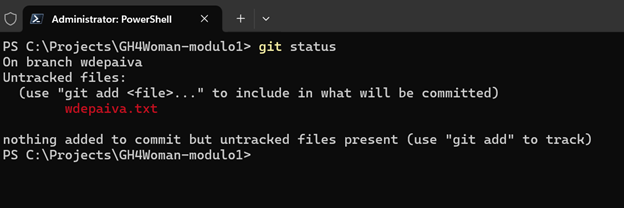
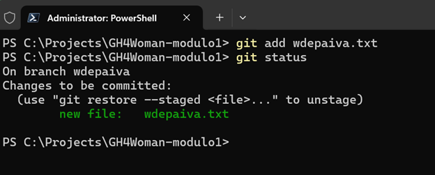
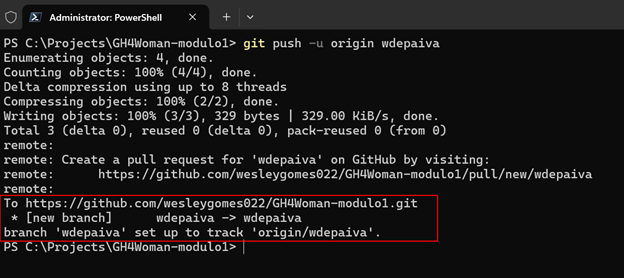
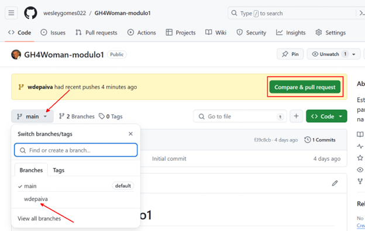
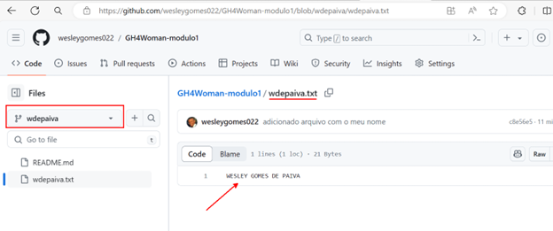

# Laboratório – Módulo 1: Introdução ao Git e GitHub

Neste laboratório, vamos realizar algumas funções básicas do Git e GitHub. Ao concluir, você terá realizado operações de criação de arquivos e registro de mudanças, assim como submissão e disponibilização deste arquivo dentro de um repositório no GitHub e tudo isso em sua própria Branch. Vamos embarcar!

1. Navegue até o repositório GitHub através deste [link](https://github.com/wesleygomes022/GH4Woman-modulo1)
2. Faça o clone do repositório
    1. Vá em code e copie o link HTTPS 
    
    1. Em seguida, abra um terminal powershell e com o git já instalado em sua máquina e rode o comando `git clone <link copiado>` 
    
1. Abra o repositório no MS Explorer e crie um arquivo de texto com a inicial do seu nome e seu sobrenome escrito. Ex: se seu nome for **João Victor Souza**, seu arquivo deve se chamar **jvsouza.txt**.  

1. Abra o arquivo *.txt* com seu nome e escreva seu nome completo dentro dele. Após isto, salve (Ctrl + S) e feche o arquivo. 

1. Volte ao Powershell e crie uma Branch com o mesmo nome de seu arquivo *.txt* (sua inicial + sobrenome). Faça isto através do comando `git checkout -b <nome-branch>` 

1. Execute o comando `git status`: retorna o status de todos os comandos no **working directory** e **staging area**.
     
    > Observe que ele nos retorna que o arquivo foi adicionado ao working directory.

1. Execute o comando `git add <nome-arquivo>`: adiciona o arquivo à staging area. 
    > Veja que o mesmo arquivo agora aparece na cor verde e já na staging area.

1. Execute o comando `git commit -m “adicionado arquivo com o meu nome”`: este comando registra as alterações e gera um novo commit como parte do histórico do repositório. 

1. Execute o comando `git push -u origin <nome-branch>`: este comando irá criar sua Branch remota (no repositório do GitHub) e fará o carregamento deste commit para lá. 

1. Navegue até o repositório no GitHub, clique no ícone da *main branch* e selecione sua própria branch. 

    Após isto, você poderá visualizar seu arquivo criado. 

### Parabéns! Você concluiu o laboratório com sucesso! 🎉
// Initial commit
